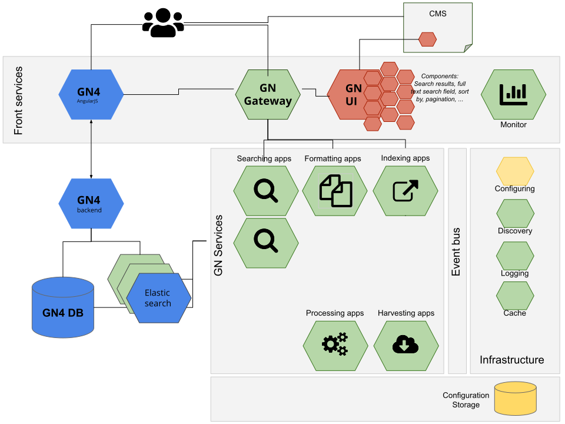
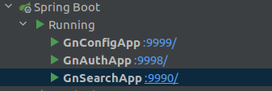

# GeoNetwork opensource services

GeoNetwork microservices is GeoNetwork ready to use in the cloud through dockerized microservices. It will work along with GeoNetwork 4 as it will only provide part of the application functionalities.

* [Configuration](configuring/README.md)
* [Authorizing by using JWT](authorizing/README.md)
* [Searching](authorizing/README.md)
* [Routing](routing/README.md)
* [Indexing](indexing/README.md)
* [OGC API Records](ogc-api-records/README.md)


## Services architecture



## Build & run

### Requirements

Those components are created with the following requirements:
* Java 11 JDK
* Maven
* Docker

### Building

To build the services:

```shell script
mvn clean install
```

For a quicker build, you can skip `findbugs`, `checkstyle` and tests with:

```shell script
mvn clean install -Drelax
```

### Running

TODO

Test the service using the token:

```shell script
# Authenticate
gn_token=$( \
    curl '127.0.0.1:9988/authenticate' \
        -H 'Content-Type: application/json' \
        -X POST \
        -d '{"username":"momo","password":"password"}' \
        | jq -r '.token')

# Search using the token
gn_auth_header=$(echo "Authorization: Bearer $gn_token")
curl 127.0.0.1:9988/search -H "$gn_auth_header"
```


### Development/debug

Developments are made on https://github.com/geonetwork/geonetwork-microservices

First start the configuration service, then the others.



## Bugs

## Roadmap

TODO

## Contributing

To set license header use:

```shell script
mvn license:format
```


## Status

This is a feasibility exploration of moving from GeoNetwork monolith application to a more scalable architecture. The main ideas are:
* improve discoverability & search availability by creating a dedicated search service that can be replicated
* better Search Engine Optimization by implementing an OGC API records service with a landing page builder mechanism
* be in capacity to have background tasks like harvester and indexing that do not alter performances of the main web application.

