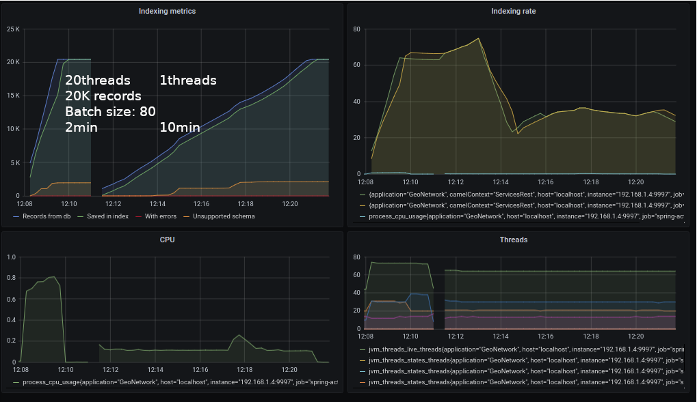

# Indexing service

This service demonstrates how to connect to the GeoNetwork database.

Database configuration is loaded from the configuration service.

Start the service using:
```
mvn spring-boot:run
```


```shell script
# Remove the index
curl '127.0.0.1:9997/api/index/records' \
    -X DELETE 

# Index all database records
curl '127.0.0.1:9997/api/index/all/all' \
   -X GET 

# Index one database record
curl '127.0.0.1:9997/api/index/simpleBatch/511' \
   -X GET 
```


## Metrics

```
gn_index_totalNumberOfRecordsToIndex 0.0
gn_index_totalNumberOfRecordsIndexed_records_total{gn="index",} 356.0

gn_index_task_771df89e_7e86_4cc5_895a_2956509c302c_numberOfRecordsIndexed_records_total{gn="index",} 89.0
```

## Performances

Currently, the indexing process is doing the following:
* Stream ids from Metadata table
* Group ids by batch size 
* Organize records per schema (XSLT step is schema dependant)
* Create one index document from DB properties
* Process batch with XSLT to add XML properties
* Send bulk request (synchronous) to index

The process is quite similar to what GeoNetwork is doing but is incomplete:
* DB properties are partial (needs to collect owner, username, validity status, ...)
* XSLT indexing is not complete
* No geometry parsing

Configuration is:

```properties
gn.indexing.batch.size=160
gn.indexing.threadPool.size=20
```

Metrics are exposed during processing: 



To be analyzed:
* What about bulk asynchronous operation?
* What happens if we configure an Elasticsearch cluster?


## Events

2 options analyzed:
* RabbitMQ
* Kafka

Spring cloud bus event works with the 2.

The configuration server can push event when config change, to reload the configuration in each microservices using:
```shell script
curl -X POST http://localhost:9999/actuator/bus-refresh
```
or webhooks.

The indexing service create a `gn_indexing_tasks_stream` topic. 

Custom `IndexEvent` was tested. A REST endpoint allows to send a message on the topic.

```shell script
curl '127.0.0.1:9997/index/event'  \
      -X POST \
      -H "Accept: application/json" \
      -H "Content-type: application/json" \
      -d '{"uuid": [1], "bucket": "e101"}'
```

The message is consumed by the `EventConsumer` bean and by the camel route (using kafka or rabbitmq components).


To install rabbitmq:

```shell script
docker pull rabbitmq:3-management
docker run -d --hostname my-rabbit --name some-rabbit -p 15672:15672 -p 5672:5672 rabbitmq:3-management
```

To install kafka, see https://kafka.apache.org/quickstart and start Kafka:

```shell script
tar -xzf kafka_2.13-2.6.0.tgz
cd kafka_2.13-2.6.0
bin/zookeeper-server-start.sh config/zookeeper.properties
bin/kafka-server-start.sh config/server.properties
```
